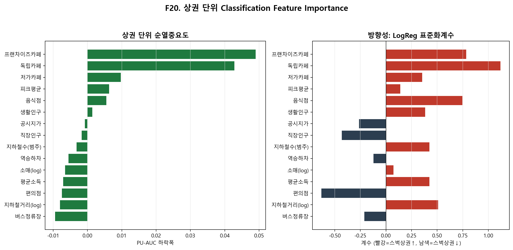
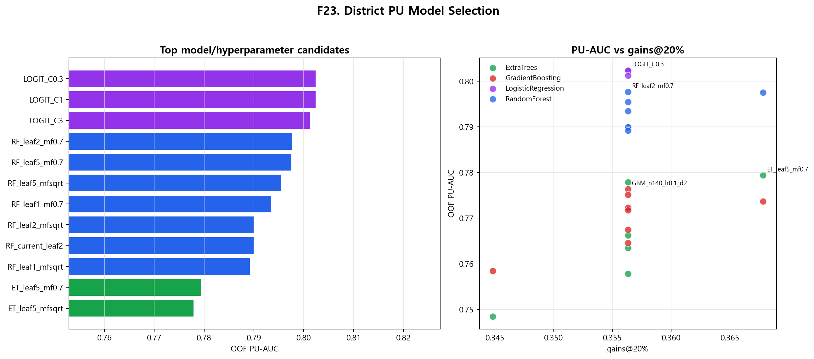

# 상권 단위 고도화 및 최종 결론 보고서

> **과목**: 2026-1 데이터마이닝 텀프로젝트  
> **작성일**: 2026-06-14  
> **범위**: 카페 단위 PU classification의 한계를 상권 단위로 보강하고, 서울대 결론의 신뢰성을 검증  
> **선행 문서**: [`01_modeling_summary.md`](01_modeling_summary.md)는 카페 단위 1차 분석이다.

---

## 0. 최종 결론 요약

카페 단위 모델은 스타벅스형 입지를 어느 정도 정렬했지만, 실제 입점 의사결정은 개별 카페 하나가 아니라 **상권 단위**에 더 가깝다. 특히 이미 스타벅스가 있는 상권 안의 비스타벅스 카페는 부적합 음성이 아니라, 스타벅스가 점유한 상권의 일부일 가능성이 높다.

따라서 최종 분석은 카페를 삭제하지 않고, DBSCAN으로 자연 상권을 만들고, 각 상권의 평균 입지환경으로 다시 PU learning을 수행했다. 그 결과 카페 단위 PU-AUC 약 0.677에서 상권 단위 RF 기준 PU-AUC 0.784로 개선됐다. 이후 상권 단계에서도 모델 family와 hyperparameter를 비교해 최고 OOF PU-AUC 0.802까지 확인했다.

서울대 관악캠퍼스는 카페 단위에서는 중간권처럼 보일 수 있었지만, 상권 단위에서는 **상권 적합도 0.308, 19백분위**로 낮게 나타난다. 최종 결론은 서울대 내부가 스타벅스형 상권이라기보다 역세권·상권밀도 조건이 약한 **비역세권형 고립 상권**에 가깝다는 것이다.

---

## 1. 왜 상권 단위가 필요한가

카페 단위 분석의 핵심 한계는 U 라벨의 의미다. 비스타벅스 카페를 확정 음성으로 보지 않는 PU learning을 쓰더라도, 개별 카페 단위에서는 다음 문제가 남는다.

- 스타벅스가 이미 있는 상권 안의 비스타벅스 카페는 "스벅이 못 가는 곳"이 아니다.
- 같은 건물이나 같은 거리의 여러 카페는 사실상 같은 입지환경을 공유한다.
- 서울대 질문도 "캠퍼스 안 특정 카페 하나"보다 "서울대가 하나의 상권으로 어떤가"에 가깝다.

처음 생각할 수 있는 방법은 스벅상권 안의 비스타벅스 카페를 제외하는 것이다. 하지만 이 방식은 평가를 쉽게 만드는 함정이 있다.

| 설정 | 음성(U) 정의 | 평가셋 | PU-AUC | 판정 |
|---|---|---|---:|---|
| baseline | 전체 비스타벅스 | 전체 | 0.677 | 카페 단위 기준선 |
| B1 clean-U | 비스벅상권 카페만 학습 음성으로 사용 | 전체 | 0.614 | 공정평가 시 하락 |
| B2 clean-eval | 비스벅상권 카페만 사용 | 스벅상권 제외 | 0.893 | 평가셋 축소에 따른 허수 상승 |

스벅상권 내 비스타벅스 카페는 전체 U의 약 75%(16,135개)다. 이들은 가장 애매하지만 정보량이 큰 hard-negative다. 이들을 지우면 문제가 쉬워져 보이거나, 반대로 경계를 제대로 배우지 못한다. 따라서 정답은 카페를 지우는 것이 아니라 **분석 단위를 상권으로 격상**하는 것이다.

---

## 2. 상권 정의: DBSCAN auto-eps

상권은 DBSCAN으로 정의했다. 임의 반경을 고정하지 않고, k-거리 elbow로 eps를 자동 결정했다.

1. 각 카페에서 k번째 최근접 카페 거리 계산 (`min_samples=5`).
2. 22,305개 거리를 내림차순 정렬.
3. 곡률이 급변하는 elbow point를 노이즈와 군집의 경계로 사용.
4. 결과 eps = 223m, min_samples = 5.

이 방식은 클러스터링 단계의 밀도 기반 판단과 같은 철학을 따른다. 결과적으로 상권은 170개로 나뉘었다.

| 항목 | 값 |
|---|---:|
| 전체 상권 수 | 170 |
| 스벅상권 | 87 |
| 비스벅상권 | 83 |
| 상권 크기 중앙값 | 13 카페 |
| 초기 노이즈 | 831개(3.7%), 이 중 스벅 15개 |

노이즈 카페는 최종 채점 단계에서 가장 가까운 상권에 흡수했다. 미흡수 auto-eps 정의의 PU-AUC는 0.811로 가장 높지만 카페 커버리지가 96.3%에 머문다. 최종 모델은 성능 최적값만 고르는 대신 데이터 손실 없이 전체 카페를 설명하기 위해 흡수 버전을 사용했고, 30-bag RF 기준 PU-AUC 0.784를 얻었다. 흡수된 고립 스벅 15개는 외곽·DT·랜드마크형 특수입지로 해석한다.

---

## 3. 상권 피처와 라벨

상권 피처는 카페 단위 15개 분류 피처의 평균으로 만든다. 상권 라벨은 구성 카페 중 스타벅스가 1개라도 있으면 Positive, 없으면 Unlabeled로 둔다.

| 구성 | 정의 | 이유 |
|---|---|---|
| 상권 피처 | 구성 카페의 15개 입지 피처 평균 | 개별 좌표·지오코딩 노이즈를 줄이고 상권 환경을 대표 |
| 상권 라벨 | 스타벅스가 1개 이상 있으면 P, 없으면 U | 입점 여부를 상권 유치 여부로 재정의 |
| 누수 관리 | 스타벅스 거리 변수 제외 | 카페 단위와 동일하게 라벨 직접 암기 방지 |

피처는 교통, 유동, 상권밀도, 소득, 직장인구, 생활인구, 지가처럼 입지환경을 나타내는 변수다. "스벅 개수"나 "스벅까지 거리"를 입력하지 않으므로 상권 라벨이 피처에 직접 새지 않는다.

---

## 4. 상권 정의 고도화 비교

DBSCAN 반경과 HDBSCAN 대안을 비교해 상권 정의가 특정 파라미터 운에 의존하지 않는지 확인했다.

| 정의 | 상권 수 | 카페 커버 | 상권 PU-AUC |
|---|---:|---:|---:|
| **DBSCAN auto-eps 223m** | 170 | 0.96 | **0.811** |
| DBSCAN 250m | 134 | 0.97 | 0.777 |
| DBSCAN 150m | 488 | 0.89 | 0.756 |
| DBSCAN 100m | 905 | 0.71 | 0.726 |
| HDBSCAN mcs20 | 133 | 0.68 | 0.710 |
| HDBSCAN mcs10 | 420 | 0.63 | 0.657 |

합리적인 DBSCAN 범위에서는 0.73-0.81 수준의 개선이 유지된다. HDBSCAN은 서울 카페 분포에서는 커버리지가 낮아지고 성능도 DBSCAN보다 약했다. 그래서 auto-eps DBSCAN을 최종 상권 정의로 채택했다.

---

## 5. 상권 단위 PU 결과

상권 단위 모델은 카페 단위 모델과 같은 PU 문제의식에서 출발하지만, 후보 단위를 카페가 아니라 상권으로 바꾼다.

| 분석 단위 | PU-AUC | Bootstrap 95% CI | 해석 |
|---|---:|---|---|
| 카페 단위 기준선 | 0.678 | [0.659, 0.698] | 개별 좌표 기준 스타벅스형 순위 |
| **상권 단위** | **0.784** | **[0.716, 0.850]** | 상권 평균으로 노이즈를 줄인 뒤 분리력 상승 |

상권 단위 개선은 단순히 쉬운 카페를 지운 결과가 아니다. B1/B2 비교에서 보듯, 카페 제외 방식은 공정평가에서는 하락하거나 평가셋 축소로 허수를 만든다. 상권 단위 분석은 카페를 보존하면서 질문 단위를 바꾼 것이므로 더 타당하다.

---

## 5-1. 상권 단위 Feature Importance

상권 단위 모델에도 feature importance를 별도로 계산했다. 방식은 최종 상권 모델과 동일하게 DBSCAN auto-eps 223m와 노이즈 흡수를 적용해 170개 상권을 만들고, 각 상권의 평균 피처로 spatial GroupKFold PU-bagging을 다시 수행했다. 중요도는 validation fold에서 해당 피처를 섞었을 때 PU-AUC가 얼마나 떨어지는지로 계산했다.

| 순위 | 변수 | 순열중요도 | LogReg 방향 | 해석 |
|---:|---|---:|---|---|
| 1 | 프랜차이즈카페 | 0.0490 | + | 다른 프랜차이즈 카페가 밀집한 상권일수록 스벅상권 신호가 강함 |
| 2 | 독립카페 | 0.0428 | + | 전체 카페 수요와 카페 소비 밀도를 가장 직접적으로 반영 |
| 3 | 저가카페 | 0.0097 | + | 카페 수요 저변과 유동 상권의 보조 신호 |
| 4 | 피크평균 | 0.0063 | + | 시간대별 유동량이 있는 상권일수록 적합도 상승 |
| 5 | 음식점 | 0.0055 | + | 외식·상업 밀도가 있는 상권 신호 |
| 6 | 생활인구 | 0.0014 | + | 상권 체류·생활 수요의 약한 보조 신호 |

해석상 핵심은 카페 단위와 다르다. 카페 단위에서는 지하철 접근성이나 소득 변수도 강하게 보였지만, 상권 단위로 평균화하면 **카페 생태계 밀도와 상업 수요**가 더 직접적인 분리 신호가 된다. 반대로 지하철거리, 버스정류장, 편의점, 평균소득처럼 순열중요도가 0 이하인 변수는 방향 계수는 있을 수 있어도 validation 성능을 안정적으로 올리는 핵심 변수로 보기는 어렵다.

---

## 5-2. 상권 단위 모델 선택 고도화

상권 단위에서도 기존 19번 최종 모델은 고정 RandomForest 설정을 사용하고 있었다. 이 상태로는 "상권 단위로 바꿨다"는 개선은 있지만, 데이터마이닝 관점에서 모델 선택 고도화가 충분하다고 보기 어렵다. 그래서 23번 스크립트에서 상권 단위 PU learning을 다음 절차로 다시 설계했다.

| 단계 | 수행 내용 | 누수/공정성 관리 |
|---|---|---|
| 1. 상권 프레임 고정 | 19번 최종 모델과 동일하게 DBSCAN auto-eps 223m와 노이즈 최근접 흡수로 170개 상권 생성 | 모델 비교 때 상권 정의가 바뀌지 않도록 고정 |
| 2. 상권 피처 재집계 | 카페 단위 leakage-free 15개 분류 피처를 상권별 평균으로 변환 | `log_dist_starbucks`와 스벅 개수는 입력 피처에서 제외 |
| 3. 상권 라벨 재정의 | 구성 카페 중 스타벅스가 1개 이상이면 P, 없으면 U | 비스타벅스 상권을 확정 음성으로 보지 않는 PU 구조 유지 |
| 4. 공간 검증 | 상권 중심 좌표를 0.02도 grid로 묶고 spatial GroupKFold(5) 적용 | 가까운 상권이 train/test에 섞이는 공간 누수 완화 |
| 5. fold 내부 PU bagging | train fold에서 P 수만큼 U를 반복 표본추출하고 base learner를 학습한 뒤 확률 평균 | test fold는 학습/샘플링/스케일링에 사용하지 않음 |
| 6. 모델/하이퍼파라미터 비교 | RandomForest, ExtraTrees, GradientBoosting, LogisticRegression의 grid 비교 | 모든 후보를 같은 fold, 같은 PU bagging 횟수, 같은 지표로 평가 |

비교 grid는 RandomForest/ExtraTrees의 `min_samples_leaf`, `max_features`, GradientBoosting의 `n_estimators`, `learning_rate`, `max_depth`, LogisticRegression의 regularization `C`를 바꾸는 방식으로 구성했다. 선택 기준은 OOF PU-AUC를 1순위로 두고, 실제 후보 추천력은 lift@5%와 gains@20%로 함께 확인했다.

| 후보 | 역할 | OOF PU-AUC | lift@5% | gains@20% |
|---|---|---:|---:|---:|
| LOGIT_C0.3 | AUC 최적 | **0.802** | 1.52 | 0.356 |
| RF_leaf2_mf0.7 | RF 튜닝 최상 | 0.798 | **1.95** | 0.356 |
| RF_leaf5_mf0.7 | 상위 20% 회수율 우수 | 0.798 | **1.95** | **0.368** |
| RF_current_leaf2 | 기존 기준선 | 0.790 | **1.95** | 0.356 |

결론은 두 가지다. 첫째, 상권 단계에도 명시적인 모델 선택과 hyperparameter 비교가 추가되면서 단순히 "RF 하나를 돌린 결과"가 아니게 됐다. 둘째, 전체 순위 성능(PU-AUC)은 LogisticRegression C=0.3이 가장 높지만, 실제 후보 상위권 집중도는 RF 계열이 더 강하다. 따라서 보고서에서는 AUC 최적 후보와 상위 후보 추천 관점을 분리해 해석한다.

단, 23번 모델 선택은 후보 비교 시간을 줄이기 위해 PU bagging 15회로 통일했고, 19번 최종 RF 채점은 30회를 사용한다. 그래서 RF 기준선의 소수점 값은 19번 재현값 0.784와 23번 비교값 0.790 사이에 약간 차이가 난다.

---

## 6. 신뢰성 지표

정확도와 F1은 여전히 주력 지표가 아니다. U에는 숨은 양성이 섞여 있어 음성 라벨 기반 지표가 왜곡되기 때문이다. 최종 신뢰성은 다음 다층 지표로 확인했다.

| 관점 | 지표 | 결과 | 의미 |
|---|---|---|---|
| 순위 성능 | PU-AUC | 카페 0.678 / 상권 0.784 | 스타벅스 입지를 U보다 위로 올리는 능력 |
| 불확실성 | Bootstrap CI | 카페 [0.659,0.698] / 상권 [0.716,0.850] | 둘 다 무작위 0.5와 분리 |
| 상위 후보 가치 | lift@5% | 2.88 | 상위 5% 후보의 스타벅스 밀도가 평균의 2.88배 |
| 커버리지 | gains@20% | 41.7% | 상위 20% 후보가 기존 스타벅스의 41.7%를 포함 |
| 미래 검증 | OOT recall@20% | 0.875 | 신규 스벅 8곳 중 7곳을 상위 20% 후보가 덮음 |
| 모델 의존성 | 모델간 Spearman | 평균 0.874, 최소 0.772 | 알고리즘이 달라도 비슷한 입지를 상위로 봄 |
| 점수 단조성 | 신뢰도곡선 rho | 0.976 | 점수가 높을수록 실제 스타벅스 비율이 일관되게 증가 |
| 확률 보정 | Elkan c / 추정 pi | c=0.567, pi≈5.4% | 라벨 양성 3.05%보다 넓은 스벅형 입지 풀이 있음을 시사 |

각 지표의 역할은 다르다.

- PU-AUC는 전체 순위 성능을 본다.
- lift와 gains는 상위 후보를 볼 때 실제로 얼마나 유용한지 보여준다.
- bootstrap CI는 점추정의 불확실성을 보완한다.
- 모델간 Spearman은 결과가 특정 알고리즘의 산물이 아님을 확인한다.
- OOT recall은 수집 이후 신규 입점이라는 시간적으로 분리된 정답으로 외적 타당성을 확인한다.
- 신뢰도곡선 rho는 점수를 연속 적합도로 해석해도 되는지 확인한다.

PU 구조상 precision 계열의 절대값은 숨은 양성을 오답으로 계산하므로 보수적 하한으로 봐야 한다.

---

## 7. 서울대 상권 채점

서울대 관악캠퍼스는 교내 카페 15개를 하나의 상권처럼 평균해 채점했다.

| 대상 | 상권 적합도 | 백분위 | 스벅 |
|---|---:|---:|---:|
| 한양대 | 0.99 | 98 | 5 |
| 이화여대 | 0.99 | 96 | 11 |
| 서강대 | 0.97 | 94 | 14 |
| 연세대 | 0.96 | 90 | 9 |
| 건국·경희 | 0.95 | 90 |  |
| 고려대 | 0.90 | 85 | 4 |
| 홍익·중앙 | 0.87 | 81 |  |
| **서울대** | **0.308** | **19** | **0** |

카페 단위에서는 서울대 내부가 55백분위로 중간권처럼 보였지만, 상권 단위에서는 19백분위로 낮게 나타난다. 이 차이가 중요하다. 서울대 질문은 특정 교내 카페 하나가 아니라, 캠퍼스 전체가 스타벅스형 상권인가에 가깝기 때문이다.

타 대학은 캠퍼스 내부 또는 1km 내에 신촌, 안암, 왕십리 같은 강한 인접 상권이 붙어 있다. 반면 서울대는 1km 내 카페가 12개뿐이고, 정문 밖 서울대입구역 권역과 캠퍼스 내부가 상권적으로 분리되어 있다.

---

## 8. 최종 해석

서울대에 스타벅스가 없는 이유는 "서울대라는 브랜드가 약해서"가 아니라, 캠퍼스 내부가 스타벅스가 선호하는 상업입지 조건과 다르기 때문이다.

카페 단위 분석에서 확인한 스타벅스형 동인은 역세권 접근성, 평균소득, 생활인구, 프랜차이즈 카페 집적이었다. 상권 단위로 보면 서울대 내부는 이 조건 중 특히 역세권성과 상권 밀도가 약하다. 반대로 서울대입구역 권역은 상업활성형 고적합 입지이며 이미 스타벅스가 존재한다.

따라서 최종 결론은 다음과 같다.

1. 카페 단위 PU 모델은 스타벅스형 입지의 1차 기준선을 제공한다.
2. 하지만 최종 입점 해석은 개별 카페보다 상권 단위가 더 타당하다.
3. 상권 단위 고도화는 카페 제외 없이 성능과 해석력을 동시에 개선한다.
4. 서울대 관악캠퍼스 내부는 서울 주요 대학 상권 중 낮은 적합도에 속하는 고립 상권이다.
5. 서울대 주변의 스타벅스 적합성은 캠퍼스 내부가 아니라 서울대입구역 상권에 집중된다.

---

## 9. Clustering으로 상권 점수 해석하기

상권 단위 PU 점수에 기존 clustering의 C0~C4 persona 배정을 그대로 붙여, 점수가 높고 낮은 이유를 상권 구성 언어로 다시 해석했다. 이 분석은 최종 예측 feature를 새로 추가해 성능을 주장하는 단계가 아니라, 이미 만든 classification 결과를 설명하기 위한 post-hoc bridge다. 특히 기존 C0~C4 clustering은 `log_dist_starbucks`를 포함하므로, 아래 결과는 예측력 개선 근거가 아니라 해석 보강 근거로 사용한다.

C0~C4의 의미는 기존 clustering 보고서와 동일하게 유지했다.

| Persona | 해석 |
|---|---|
| C0 | 오피스고소득 |
| C1 | 상업활성 |
| C2 | 주거생활 |
| C3 | 도심초밀집 |
| C4 | 비역세권 |

상권 점수 분위별 persona 구성을 보면, 낮은 분위에서는 C2 주거생활과 C4 비역세권이 대부분을 차지한다. 반대로 상위 분위로 갈수록 C1 상업활성, C0 오피스고소득, C3 도심초밀집이 나타난다. 따라서 `C0+C1+C3`을 스타벅스 핵심 persona 비중으로 보면, 이 값은 상위 분위에서만 의미 있게 증가한다.

| 점수 분위 | 평균 백분위 | C0 | C1 | C2 | C3 | C4 | 핵심(C0+C1+C3) |
|---|---:|---:|---:|---:|---:|---:|---:|
| D1 | 5 | 0% | 0% | 31% | 0% | 69% | 0% |
| D2 | 15 | 0% | 0% | 27% | 0% | 73% | 0% |
| D3 | 25 | 0% | 0% | 28% | 0% | 72% | 0% |
| D4 | 35 | 0% | 0% | 54% | 0% | 46% | 0% |
| D5 | 45 | 0% | 0% | 43% | 0% | 57% | 0% |
| D6 | 55 | 0% | 0% | 38% | 0% | 62% | 0% |
| D7 | 65 | 0% | 0% | 62% | 0% | 38% | 0% |
| D8 | 75 | 6% | 4% | 53% | 0% | 37% | 10% |
| D9 | 85 | 13% | 19% | 33% | 1% | 34% | 33% |
| D10 | 95 | 0% | 27% | 49% | 1% | 23% | 28% |

대학 상권 fingerprint에서도 서울대는 다른 고득점 대학과 명확히 다르다. 한양대, 이화여대, 서강대, 건국대는 C1 상업활성 비중이 높고, 홍익대는 C3 도심초밀집 비중이 높다. 반면 서울대 관악캠퍼스 1km 내 카페는 C4 비역세권으로만 배정되어, 상권 적합도 0.324와 20백분위라는 낮은 점수와 같은 방향의 설명을 제공한다.

| 대상 | 상권 적합도 | 백분위 | 스벅 | 최빈 persona | 핵심(C0+C1+C3) | C4 |
|---|---:|---:|---:|---|---:|---:|
| 한양대 | 0.992 | 98 | 5 | C1 상업활성 | 49% | 5% |
| 이화여대 | 0.987 | 97 | 11 | C1 상업활성 | 64% | 19% |
| 서강대 | 0.973 | 95 | 14 | C1 상업활성 | 64% | 3% |
| 연세대 | 0.955 | 94 | 9 | C4 비역세권 | 38% | 60% |
| 건국대 | 0.954 | 93 | 10 | C1 상업활성 | 57% | 22% |
| 경희대 | 0.949 | 92 | 6 | C4 비역세권 | 22% | 53% |
| 고려대 | 0.900 | 85 | 4 | C2 주거생활 | 0% | 12% |
| 중앙대 | 0.865 | 82 | 3 | C2 주거생활 | 0% | 21% |
| 홍익대 | 0.876 | 82 | 11 | C3 도심초밀집 | 93% | 0% |
| **서울대** | **0.324** | **20** | **0** | **C4 비역세권** | **0%** | **100%** |

발표용 그림은 다음 네 장으로 정리했다.

- [F16 District Persona Bridge Map](archive/figures/classification/02_district_level/F16_district_persona_bridge_map.png)
- [F17 University Persona Fingerprint](archive/figures/classification/02_district_level/F17_university_persona_fingerprint.png)
- [F21 Top 20 District Persona Fingerprint](archive/figures/classification/02_district_level/F21_top20_district_persona_fingerprint.png)
- [F18 Persona Share by Score Decile](archive/figures/classification/02_district_level/F18_persona_score_decile_heatmap.png)
- [F19 SNU Persona Interpretation Card](archive/figures/classification/02_district_level/F19_snu_persona_interpretation_card.png)
- [F20 District Feature Importance](archive/figures/classification/02_district_level/F20_district_feature_importance.png)
- [F22 New Starbucks District Persona Fingerprint](archive/figures/classification/02_district_level/F22_new_starbucks_district_persona_fingerprint.png)
- [F23 District Model Selection](archive/figures/classification/02_district_level/F23_district_model_selection.png)

이 bridge를 적용하면 서울대 결론은 더 읽기 쉬워진다. 카페 단위에서는 서울대 내부 일부 카페가 중간권처럼 보일 수 있지만, 상권 단위로 보면 서울대 내부는 C0/C1/C3 같은 스타벅스 핵심 persona 비중이 0%이고 C4 비역세권 비중이 100%다. 즉 서울대의 낮은 점수는 단일 카페의 문제가 아니라, 캠퍼스 내부 상권 구성이 스타벅스 핵심 상권 persona와 다르다는 결과다.

---

## 10. 한계

1. 상권 6피처 재계산을 위한 원천 상가정보가 없어서 신규 후보 좌표를 완전히 새로 featurize하지는 못했다.
2. 교내 카페 일부 좌표는 지오코딩 fallback과 행정동 단위 피처를 포함하므로 교내 세부 지점 간 비교보다 캠퍼스 단위 결론이 더 신뢰 가능하다.
3. PU learning은 SCAR 가정을 근사적으로 사용한다. 스타벅스 입점은 랜덤 라벨링이 아니므로 점수는 절대 확률보다 상대 적합도로 해석해야 한다.
4. DBSCAN 상권은 single-link 특성 때문에 일부 도심 상권이 크게 연결될 수 있다. 다만 대안 정의 비교에서 결론 방향은 유지됐다.
5. C0~C4 bridge는 기존 clustering 배정을 그대로 쓰는 해석 layer다. 따라서 성능 개선용 독립 feature가 아니라, 상권 classification 결과를 설명하는 보조 근거로 봐야 한다.

---

## 11. 재현 위치

- 상권 스크립트: `scripts/06_classification/02_district_level/17_districts.py`, `18_district_advanced.py`, `19_district_final.py`, `21_district_feature_importance.py`, `23_district_model_selection.py`
- 상권-persona bridge 스크립트: `scripts/06_classification/02_district_level/20_district_persona_bridge.py`
- 신규 스타벅스 상권 배정 스크립트: `scripts/06_classification/02_district_level/22_new_starbucks_district_projection.py`
- 1단계 신뢰성 보조 스크립트: `scripts/06_classification/01_cafe_level/15_trust_metrics.py`, `16_metric_curves.py`
- 주요 산출물: `reports/generated/classification/02_district_level/outputs/district_*.csv`, `district_def_comparison.csv`, `district_feature_importance.csv`, `district_model_selection.csv`, `district_persona_*.csv`, `top20_district_persona.csv`, `new_starbucks_district_projection.csv`
- 모델: `reports/generated/classification/02_district_level/models/pu_district.joblib`
- 보존 로그: `reports/archive/classification/logs/02_district_level/DISTRICT_REPORT.md`, `PU_LOG.md`, `DISTRICT_FEATURE_IMPORTANCE_REPORT.md`, `DISTRICT_MODEL_SELECTION_REPORT.md`, `PERSONA_BRIDGE_REPORT.md`, `NEW_STARBUCKS_DISTRICT_REPORT.md`
